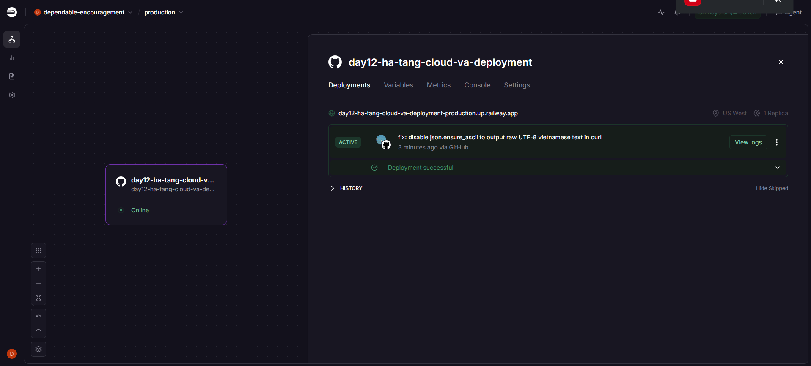
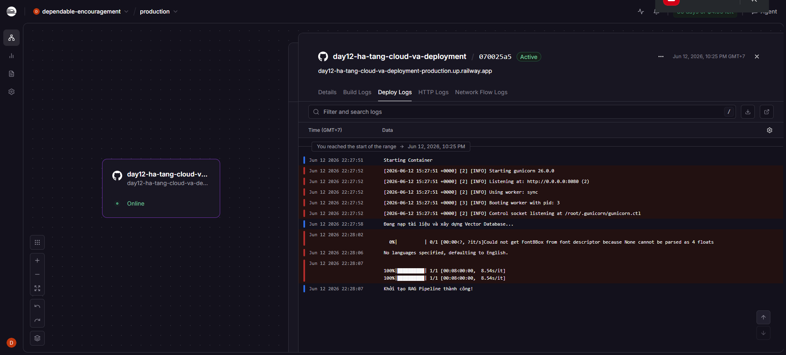
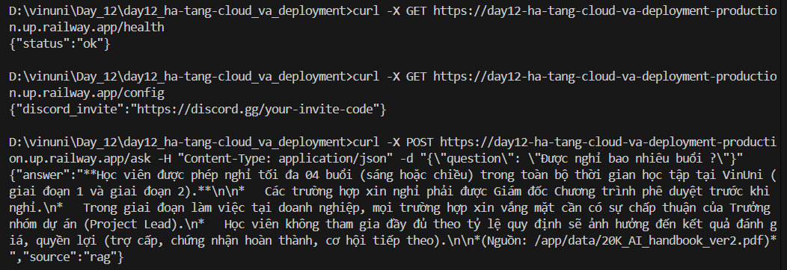

# Deployment Information

## Public URL
https://day12-ha-tang-cloud-va-deployment-production.up.railway.app

## Platform
Railway

## Test Commands

### 1. Health Check (Liveness Probe)
```bash
curl -X GET https://day12-ha-tang-cloud-va-deployment-production.up.railway.app/health
```
**Expected Response:**
```json
{
  "status": "ok"
}
```

### 2. Config Check
```bash
curl -X GET https://day12-ha-tang-cloud-va-deployment-production.up.railway.app/config
```
**Expected Response:**
```json
{
  "discord_invite": "https://discord.gg/your-invite-code"
}
```

### 3. Ask Question (RAG / Rulebase)
```bash
curl -X POST https://day12-ha-tang-cloud-va-deployment-production.up.railway.app/ask \
  -H "Content-Type: application/json" \
  -d "{\"question\": \"Được nghỉ bao nhiêu buổi ?\"}"
```
**Expected Response:**
```json
{
  "answer": "**[Câu trả lời ngắn gọn...]**\n\n- Chi tiết điểm 1...\n\n*(Nguồn: <tên file>)*",
  "source": "rag"
}
```

## Environment Variables Configured on Railway
- `PORT`: `8080` (Railway tự động ánh xạ cổng)
- `GOOGLE_API_KEY`: `<your-google-api-key>`
- `DISCORD_INVITE_URL`: `https://discord.gg/your-invite-code`
- `EMBEDDING_MODEL`: `gemini-embedding-001`
- `LLM_MODEL`: `gemini-2.5-flash`
- `RULEBASE_PATH`: `./data/rulebase.json`

## Screenshots




